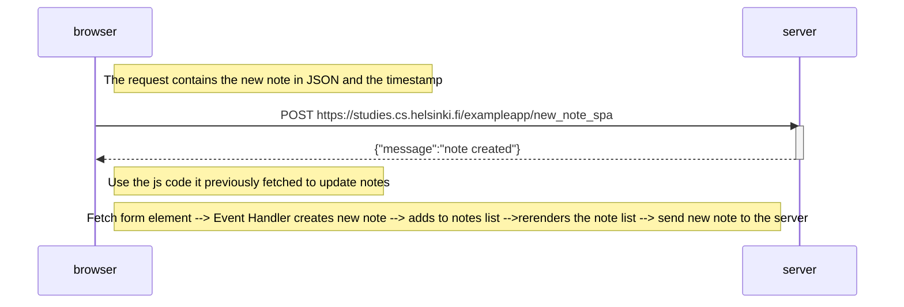

```mermaid
sequenceDiagram
    participant browser
    participant server

    Note right of browser: The request contains the new note in JSON and the timestamp

    browser->>server: POST https://studies.cs.helsinki.fi/exampleapp/new_note_spa
    activate server

    server-->>browser: {"message":"note created"}
    deactivate server

    Note right of browser: Use the js code it previously fetched to update notes

    Note right of browser: Fetch form element --> Event Handler creates new note --> adds to notes list -->rerenders the note list --> send new note to the server
    
```